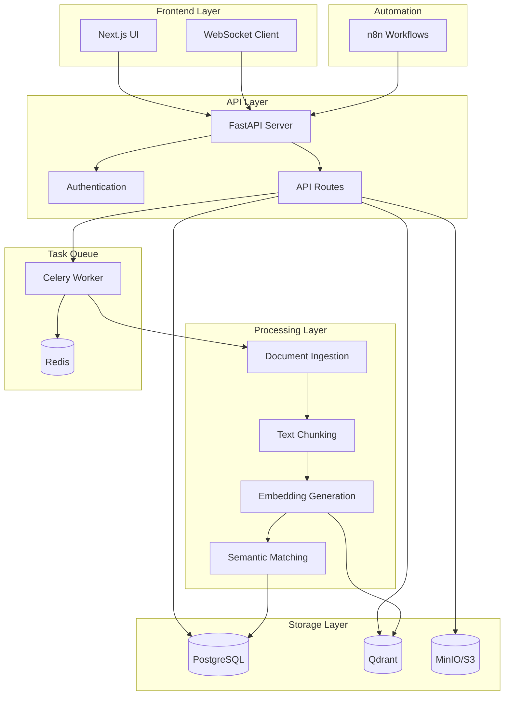
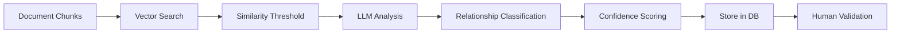
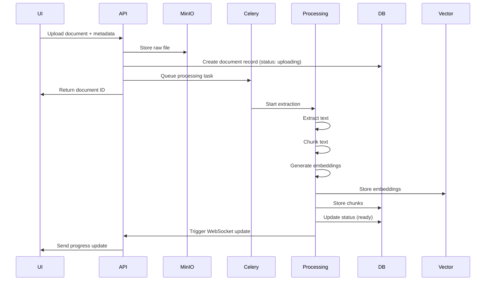
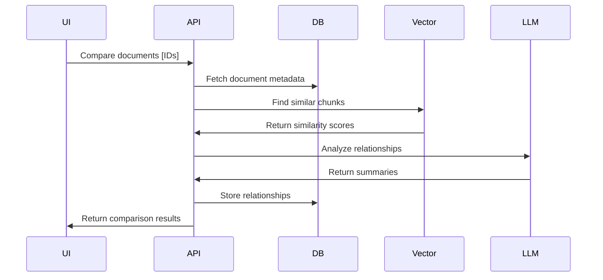

# EchoGraph Architecture

## System Overview

EchoGraph is a microservices-based platform for document compliance and comparison, leveraging AI/ML for semantic analysis and relationship discovery.

## Architecture Diagram



## Components

### 1. Frontend (Next.js)

**Technology Stack:**
- Next.js 14 with App Router
- React 18 with TypeScript
- Tailwind CSS + Shadcn/ui
- TanStack Query for data fetching
- Zustand for state management
- Framer Motion for animations

**Key Features:**
- Modern, responsive design
- Real-time progress tracking via WebSocket
- Document upload with drag-and-drop
- Multi-document comparison interface
- Validation workflow for reviewers
- Dark mode support

**Architecture:**
```
frontend/
├── src/
│   ├── app/              # Next.js pages and routes
│   ├── components/       # Reusable React components
│   │   ├── ui/          # Base UI components (Shadcn)
│   │   ├── documents/   # Document-specific components
│   │   ├── comparison/  # Comparison interface
│   │   └── validation/  # Validation workflow
│   ├── services/        # API client functions
│   ├── hooks/           # Custom React hooks
│   ├── lib/             # Utilities and helpers
│   └── types/           # TypeScript type definitions
└── public/              # Static assets
```

### 2. Backend API (FastAPI)

**Technology Stack:**
- FastAPI (Python 3.11+)
- SQLAlchemy ORM
- Pydantic for validation
- JWT authentication
- WebSocket support
- Prometheus metrics

**Key Features:**
- RESTful API with OpenAPI documentation
- Role-based access control (RBAC)
- Real-time progress updates
- Async request handling
- Comprehensive error handling

**Architecture:**
```
api/
├── main.py             # FastAPI application
├── config.py           # Configuration management
├── database.py         # Database connection
├── models.py           # SQLAlchemy models
├── schemas.py          # Pydantic schemas
├── auth.py             # Authentication logic
├── routers/            # API route handlers
│   ├── documents.py
│   ├── relationships.py
│   ├── search.py
│   ├── auth.py
│   └── websocket.py
└── tasks.py            # Celery tasks
```

### 3. Document Ingestion

**Technology Stack:**
- pdfplumber, PyMuPDF
- python-docx
- pytesseract (OCR)
- unstructured library

**Process Flow:**
1. File upload to MinIO
2. Format detection (PDF, DOCX)
3. Text extraction
4. OCR for scanned documents
5. Metadata extraction
6. Store processed text

### 4. Text Processing

**Technology Stack:**
- sentence-transformers
- LangChain
- NLTK

**Process Flow:**
1. Text chunking with structure awareness
2. Embedding generation (768-dimensional vectors)
3. Vector storage in Qdrant
4. Semantic similarity calculation

### 5. Relationship Discovery

**AI/ML Pipeline:**



**Relationship Types:**
- **Compliance**: Guideline meets norm requirements
- **Conflict**: Contradictory requirements
- **Reference**: Direct citation or mention
- **Similar**: Semantically related content
- **Supersedes**: Newer version replaces older

### 6. Data Storage

#### PostgreSQL (Primary Database)
- Document metadata
- User accounts
- Relationships
- Validation history

**Schema:**
```sql
documents (
  id, title, document_type, file_path, status,
  metadata JSONB, upload_date, processed_date
)

document_chunks (
  id, doc_id, chunk_text, chunk_index,
  embedding FLOAT[], metadata JSONB
)

document_relationships (
  id, source_doc_id, target_doc_id,
  relationship_type, confidence, summary,
  validation_status, validated_by
)

users (
  id, email, username, hashed_password,
  is_active, is_admin, is_reviewer
)
```

#### Qdrant (Vector Database)
- Document embeddings
- Semantic search
- Similarity matching

#### MinIO (Object Storage)
- Raw document files (PDF, DOCX)
- Processed documents
- Exported reports

### 7. Task Queue (Celery + Redis)

**Async Tasks:**
- Document processing
- Embedding generation
- Relationship discovery
- Batch operations

**Queue Architecture:**
```
User Upload → API → Celery Task → Worker
                         ↓
                    [Processing Steps]
                         ↓
                    Update DB → WebSocket → UI
```

### 8. n8n Automation

**Use Cases:**
- Scheduled document ingestion
- Automated compliance checks
- Notification triggers
- Report generation
- Integration with external systems

## Data Flow

### Document Upload Flow



### Document Comparison Flow



## Security

### Authentication & Authorization

- **JWT Tokens**: Secure authentication
- **Role-Based Access**: Admin, Reviewer, User roles
- **Password Hashing**: bcrypt algorithm
- **Token Expiration**: Configurable timeout

### Data Security

- **Encryption at Rest**: MinIO server-side encryption
- **Encryption in Transit**: HTTPS/WSS protocols
- **Input Validation**: Pydantic schemas
- **SQL Injection Prevention**: SQLAlchemy ORM
- **CORS Configuration**: Whitelist allowed origins

## Scalability

### Horizontal Scaling

- **API**: Multiple FastAPI instances behind load balancer
- **Workers**: Scale Celery workers independently
- **Frontend**: Edge deployment (Vercel, Cloudflare)
- **Database**: PostgreSQL read replicas

### Performance Optimization

- **Caching**: Redis for frequently accessed data
- **Connection Pooling**: Database connection reuse
- **Async I/O**: FastAPI async endpoints
- **Batch Processing**: Bulk embedding generation
- **CDN**: Static asset delivery

## Monitoring & Observability

### Metrics (Prometheus)

- API request latency
- Task queue length
- Processing time per document
- Embedding generation rate
- Database query performance

### Logging (Structured JSON)

- Application logs
- Access logs
- Error tracking (Sentry)
- Audit trails

### Health Checks

- Database connectivity
- Redis availability
- MinIO accessibility
- Qdrant status
- Celery worker health

## Deployment

### Docker Compose (Development)

```bash
docker-compose up -d
```

### Kubernetes (Production)

```yaml
- API: Deployment + Service + HPA
- Workers: Deployment + HPA
- Frontend: Deployment + Ingress
- Databases: StatefulSet + PVC
```

### CI/CD Pipeline

1. Lint & Format Check
2. Unit Tests
3. Integration Tests
4. Build Docker Images
5. Push to Registry
6. Deploy to Staging
7. E2E Tests
8. Deploy to Production

## Future Enhancements

1. **Multi-language Support**: i18n for UI and documents
2. **Advanced Analytics**: Dashboard with insights
3. **Collaborative Features**: Comments, annotations
4. **Version Control**: Document versioning with diff
5. **Export Formats**: PDF, DOCX, Excel reports
6. **API Integrations**: SharePoint, Google Drive, Confluence
7. **Machine Learning**: Improved relationship classification
8. **Graph Visualization**: Interactive relationship graphs
